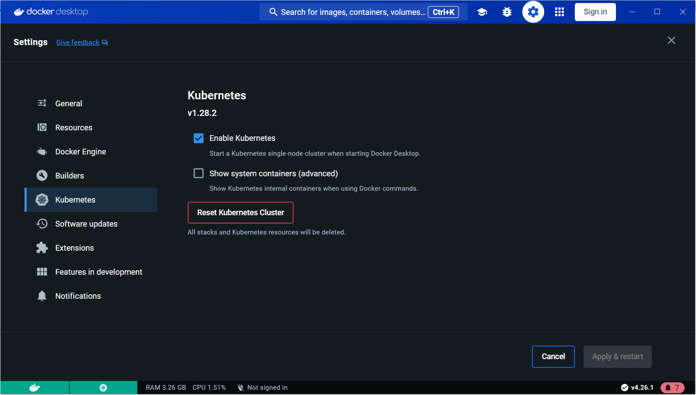

# Démarrer Camunda 8 en Local avec Kubernetes
## 1. Prérequis:
### 1.1 Télécharger et installer les applications suivantes:
[Helm](https://helm.sh/)

[Docker Desktop](https://www.docker.com/products/docker-desktop/)

[Camunda Modeler](https://camunda.com/download/modeler/)

### 1.2 Activer Kubernetes sur Docker Desktop
   

## 2. Démarrer l'application Camunda 8:

### 2.1 Cloner et se déplacer dans le repertoire de ce projet
    cd /chemin-vers/local-camunda8-with-k8s

### 2.2 Exécuter la commande suivante ajouter le repository camunda 8
    helm repo add camunda https://helm.camunda.io

### 2.3 Démarrer l'application en exécutant la commande suivante
    helm install camunda-platform camunda/camunda-platform -f camunda-platform-local-values.yaml

### 2.4 Ouvrir les ports des services afin de les rendre accessible hors du cluster 
    kubectl port-forward svc/camunda-platform-operate 8081:80 

    kubectl port-forward svc/camunda-platform-tasklist 8082:80 
    
    kubectl port-forward svc/camunda-platform-zeebe-gateway 26500:26500 -n default

### 2.5 Ouvrir Camunda Modeler pour deployer un processus

## 3. Arreter l'application Camunda 8:

### 3.1 Executer la commande
    helm uninstall camunda-platform
